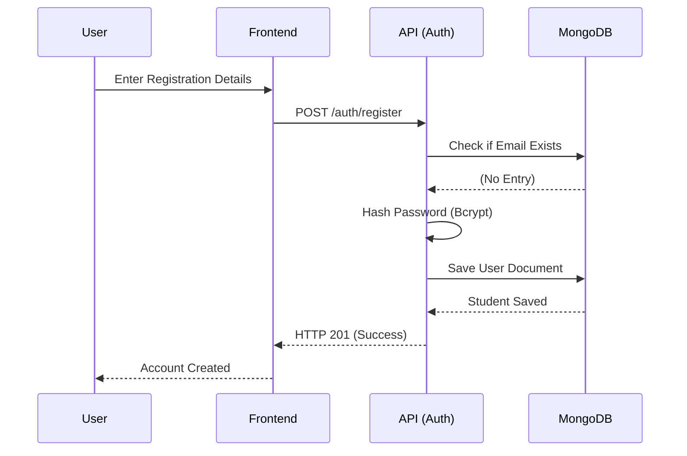
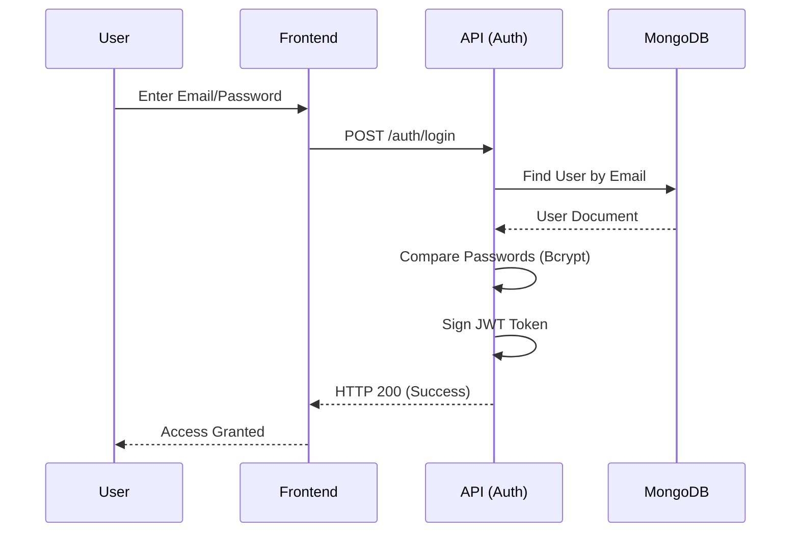
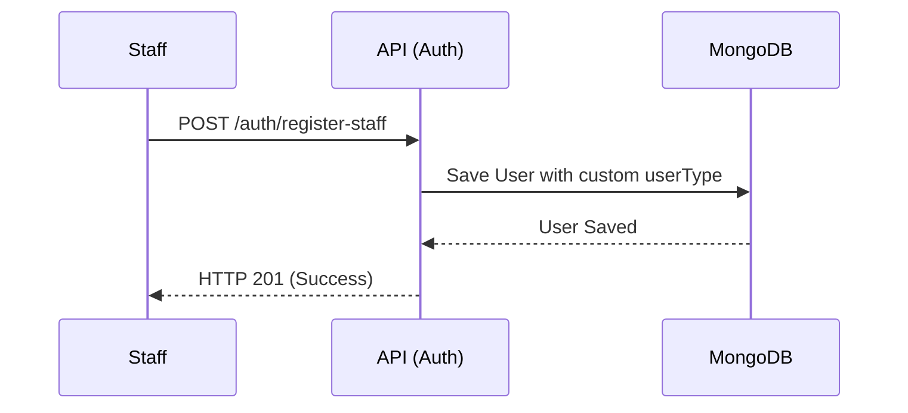
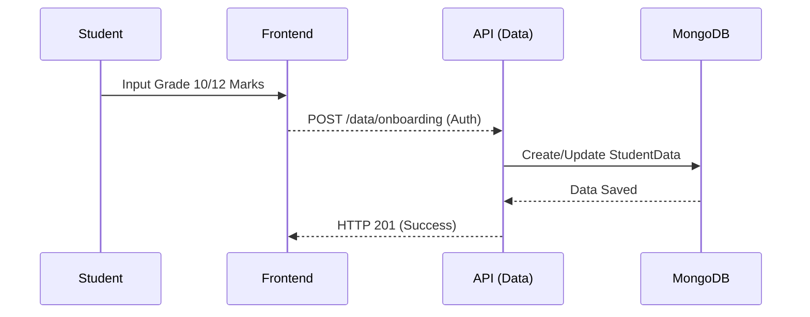
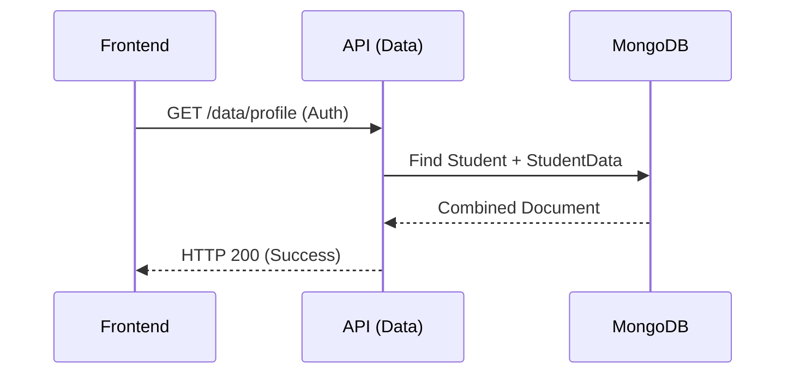
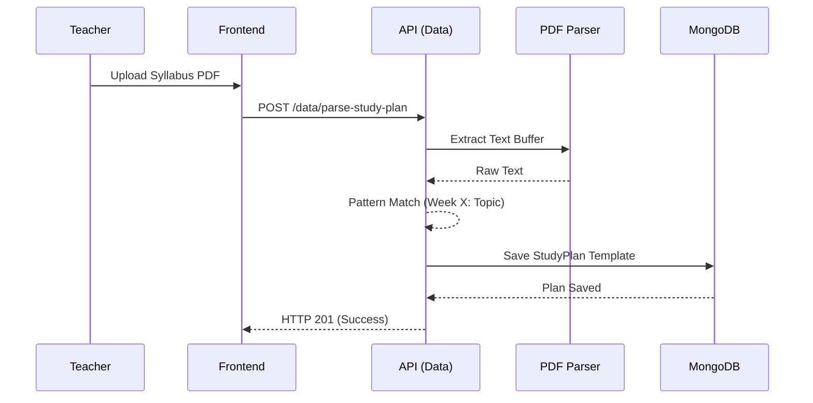
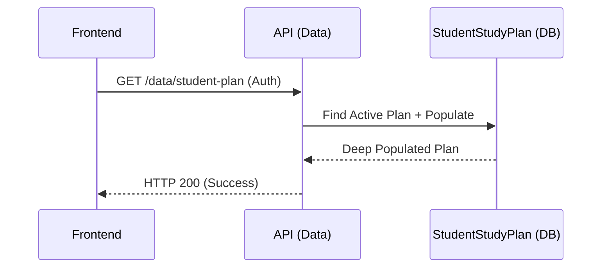
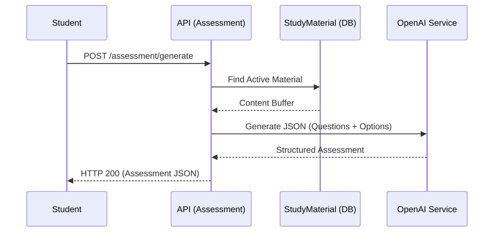
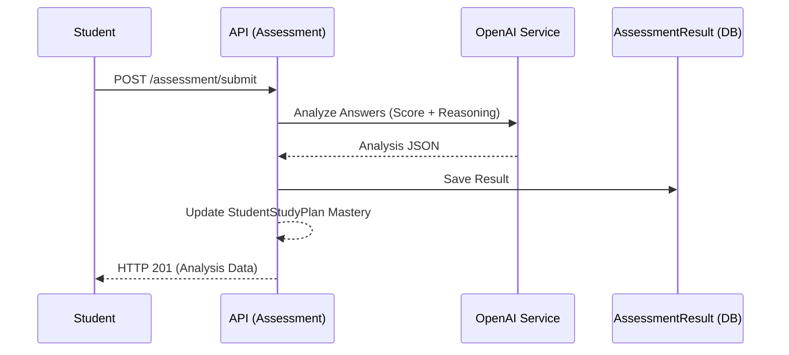
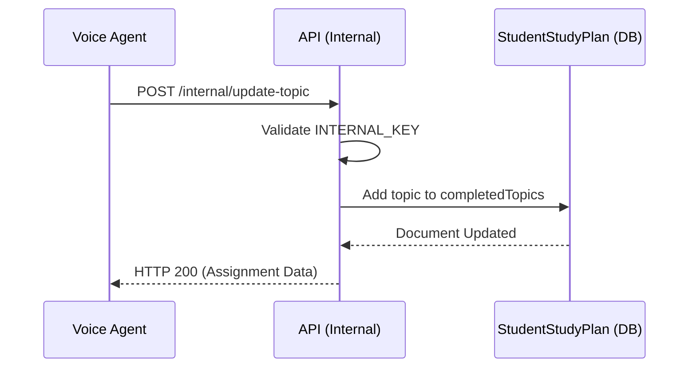

<div align="center">
  
  <h1>AI Mentor Platform</h1>
  <p><i>Next-generation personalized education powered by AI voice guidance and mastery-based tracking.</i></p>
  
  <p>
    
    
    
    
  </p>
</div>

---

## 📖 Quick Reference Table of Contents

1. [**Authentication**](#category-auth)
    - [`POST /api/auth/register`](#auth-register) - Register a new student account.
    - [`POST /api/auth/login`](#auth-login) - Authenticate and retrieve access token.
    - [`POST /api/auth/register-staff`](#auth-staff) - Create administrative or teacher accounts.

2. [**Onboarding & Profile**](#category-profile)
    - [`POST /api/data/onboarding`](#profile-onboarding) - Submit student academic baseline data.
    - [`GET /api/data/profile`](#profile-view) - Fetch complete identity and academic profile.
    - [`GET /api/data/marks`](#profile-marks) - Retrieve baseline academic markers.

3. [**Study & Mastery Management**](#category-study)
    - [`POST /api/data/parse-study-plan`](#study-parse-plan) - Extract structured weeks/topics from PDF.
    - [`POST /api/data/parse-study-material`](#study-parse-material) - Index PDF content for assessment generation.
    - [`GET /api/data/study-plans`](#study-list-plans) - List available study plan templates.
    - [`GET /api/data/study-materials`](#study-list-materials) - List all available study materials.
    - [`GET /api/data/student-plan`](#study-student-plan) - View active plan and assigned material.
    - [`GET /api/data/current-week-progress`](#study-progress) - Fetch mastery status for the current week.

4. [**Assessments**](#category-assessments)
    - [`POST /api/assessment/generate`](#assess-generate) - Generate AI-driven MCQ from study material.
    - [`POST /api/assessment/submit`](#assess-submit) - Analyze results and update topic mastery.

5. [**Internal & Agent Services**](#category-internal)
    - [`POST /api/data/internal/update-topic`](#internal-update-topic) - Signal topic completion from Voice AI.
    - [`GET /api/data/internal/current-week-progress`](#internal-progress) - Contextual data for Agent prompts.
    - [`POST /api/data/internal/reminder`](#internal-reminder) - Schedule proactive check-ins.
    - [`GET /api/data/internal/reminders`](#internal-list-reminders) - List all active reminders.
    - [`POST /api/data/internal/resolve-reminder`](#internal-resolve-reminder) - Mark a reminder as resolved.
    - [`POST /api/assessment/internal/generate`](#internal-generate-assess) - Agent-specific test generation.
    - [`POST /api/assessment/internal/submit`](#internal-submit-assess) - Voice-conducted test scoring.

---

<h2 id="category-auth">🔐 1. Authentication</h2>

<a id="auth-register"></a>
### Register Student
**URL:** `https://api.aimentor.com/api/auth/register`  
**Method:** `POST`  
**Content-Type:** `application/json`

Creates a new student account. This endpoint forces the `userType` to "student" regardless of payload input.



#### Request Body
```json
{
  "firstName": "John",
  "lastName": "Doe",
  "email": "john.doe@example.com",
  "phonenumber": "1234567890",
  "password": "securePassword123"
}
```

#### Successful Response
```json
{
  "success": true,
  "message": "Student registered successfully",
  "data": {
    "_id": "60d5f1f1f1f1f1f1f1f1f1f1",
    "firstName": "John",
    "lastName": "Doe",
    "email": "john.doe@example.com",
    "userType": "student"
  }
}
```

#### ⚠️ Error Responses
| Code | Reason | JSON Payload |
| :--- | :--- | :--- |
| 400 | Validation Failure | `{"success": false, "message": "Email is required"}` |
| 409 | Conflict | `{"success": false, "message": "Student already exists"}` |

---

<a id="auth-login"></a>
### Authenticate User
**URL:** `https://api.aimentor.com/api/auth/login`  
**Method:** `POST`  
**Content-Type:** `application/json`

Authenticates credentials and issues a JSON Web Token (JWT) valid for 24 hours.



#### Request Body
```json
{
  "email": "john.doe@example.com",
  "password": "securePassword123"
}
```

#### Successful Response
```json
{
  "success": true,
  "data": {
    "student": {
      "_id": "60d5f1f1f1f1f1f1f1f1f1f1",
      "email": "john.doe@example.com"
    },
    "token": "eyJhbGciOiJIUzI1NiIsInR5cCI6IkpXVCJ9..."
  }
}
```

---

<a id="auth-staff"></a>
### Register Staff
**URL:** `https://api.aimentor.com/api/auth/register-staff`  
**Method:** `POST`  
**Content-Type:** `application/json`

Registers an account with a custom `userType` (e.g., "teacher", "admin").



#### Request Body
```json
{
  "firstName": "Admin",
  "lastName": "User",
  "email": "admin@aimentor.com",
  "password": "adminPassword",
  "userType": "admin"
}
```

#### Successful Response
```json
{
  "success": true,
  "message": "admin registered successfully",
  "data": {
    "_id": "60d5f2...",
    "email": "admin@aimentor.com",
    "userType": "admin"
  }
}
```

---

<h2 id="category-profile">👤 2. Onboarding & Profile</h2>

<a id="profile-onboarding"></a>
### Student Onboarding
**URL:** `https://api.aimentor.com/api/data/onboarding`  
**Method:** `POST`  
**Content-Type:** `application/json`

Submits historical academic performance data for baseline assessment.



#### Request Body
```json
{
  "stream": "Science",
  "class": "12",
  "cgpa": 8.5,
  "marks": {
    "maths": 90,
    "physics": 85
  }
}
```

#### Successful Response
```json
{
  "success": true,
  "data": {
    "studentId": "60d5f1...",
    "stream": "Science",
    "class": "12",
    "cgpa": 8.5,
    "marks": { "maths": 90, "physics": 85 }
  }
}
```

---

<a id="profile-view"></a>
### View Profile
**URL:** `https://api.aimentor.com/api/data/profile`  
**Method:** `GET`

Fetches the complete student profile including identity and academic data.



#### Successful Response
```json
{
  "success": true,
  "data": {
    "_id": "60d5f1...",
    "firstName": "John",
    "email": "john@example.com",
    "academic": {
      "stream": "Science",
      "cgpa": 8.5
    }
  }
}
```

---

<a id="profile-marks"></a>
### Fetch Marks
**URL:** `https://api.aimentor.com/api/data/marks`  
**Method:** `GET`

Retrieves only the baseline academic markers (Grade 10/12) for the student.

#### Successful Response
```json
{
  "success": true,
  "data": {
    "marks": {
      "maths": 90,
      "physics": 85
    }
  }
}
```

---

<h2 id="category-study">📚 3. Study & Mastery Management</h2>

<a id="study-parse-plan"></a>
### Parse Study Plan
**URL:** `https://api.aimentor.com/api/data/parse-study-plan`  
**Method:** `POST`  
**Content-Type:** `multipart/form-data`

Uploads a PDF syllabus and uses AI to extract a week-by-week topic schedule.



#### Request Parameters
| Field | Type | Description |
| :--- | :--- | :--- |
| `pdfFile` | File (Binary) | The syllabus PDF file |
| `planName` | String | A descriptive name for the plan |

#### Successful Response
```json
{
  "success": true,
  "data": {
    "_id": "60d5f3...",
    "planName": "B.Tech Computer Science",
    "weeks": [
      { "weekNumber": 1, "title": "Introduction", "topics": ["Basics", "History"] }
    ]
  }
}
```

---

<a id="study-parse-material"></a>
### Parse Study Material
**URL:** `https://api.aimentor.com/api/data/parse-study-material`  
**Method:** `POST`  
**Content-Type:** `multipart/form-data`

Uploads a core study material PDF. The API parses text into chapters for assessment reference.

#### Request Parameters
| Field | Type | Description |
| :--- | :--- | :--- |
| `pdfFile` | File (Binary) | The material PDF file |
| `subject` | String | e.g., "Physics", "OS" |

#### Successful Response
```json
{
  "success": true,
  "data": {
    "subject": "Physics",
    "fileName": "physics_vol1.pdf",
    "chapters": [{ "chapterNumber": 1, "title": "Kinematics" }]
  }
}
```

---

<a id="study-list-plans"></a>
### List Study Plans
**URL:** `https://api.aimentor.com/api/data/study-plans`  
**Method:** `GET`

Returns a list of all available study plan templates (optimized view).

#### Successful Response
```json
{
  "success": true,
  "data": [
    { "_id": "60d5f3...", "planName": "B.Tech Computer Science" }
  ]
}
```

---

<a id="study-list-materials"></a>
### List Study Materials
**URL:** `https://api.aimentor.com/api/data/study-materials`  
**Method:** `GET`

Returns a list of all available study materials in the system.

#### Successful Response
```json
{
  "success": true,
  "data": [
    { "_id": "60d5f4...", "subject": "Physics", "fileName": "intro.pdf" }
  ]
}
```

---

<a id="study-student-plan"></a>
### View Active Student Plan
**URL:** `https://api.aimentor.com/api/data/student-plan`  
**Method:** `GET`

Fetches the currently active study plan for the logged-in student, populated with full plan and material details.



#### Successful Response
```json
{
  "success": true,
  "data": {
    "_id": "60d5f4...",
    "planId": { "planName": "B.Tech CS", "weeks": [...] },
    "studyMaterialId": { "subject": "OS", "fileName": "os_notes.pdf" },
    "startDate": "2024-04-01T00:00:00.000Z",
    "isActive": true
  }
}
```

---

<a id="study-progress"></a>
### Current Week Progress
**URL:** `https://api.aimentor.com/api/data/current-week-progress`  
**Method:** `GET`

Calculates and returns topic-by-topic mastery status for the current week.

#### Successful Response
```json
{
  "success": true,
  "data": {
    "weekNumber": 1,
    "weekTitle": "Introduction to AI",
    "allTopics": ["Turing Test", "Search Algorithms"],
    "topicStatus": [
      { "topic": "Turing Test", "status": "MASTERED" },
      { "topic": "Search Algorithms", "status": "READ_BUT_UNTESTED" }
    ],
    "isWeekCompleted": false
  }
}
```

---

<h2 id="category-assessments">📝 4. Assessments</h2>

<a id="assess-generate"></a>
### Generate Assessment
**URL:** `https://api.aimentor.com/api/assessment/generate`  
**Method:** `POST`  
**Content-Type:** `application/json`

Triggers the AI to generate a 10-question multiple-choice assessment based on the student's current pending topics.



#### Request Body
```json
{
  "materialId": "60d5f3..."
}
```

#### Successful Response
```json
{
  "_id": "60d5f5...",
  "title": "Assessment for Operating Systems",
  "questions": [
    {
      "questionText": "What is a deadlock?",
      "options": ["...", "...", "..."],
      "correctAnswer": "..."
    }
  ]
}
```

---

<a id="assess-submit"></a>
### Submit Assessment
**URL:** `https://api.aimentor.com/api/assessment/submit`  
**Method:** `POST`  
**Content-Type:** `application/json`

Analyzes student answers, scores the test, and updates topic mastery in the study plan.



#### Request Body
```json
{
  "assessmentId": "60d5f5...",
  "answers": [
    { "questionText": "What is a deadlock?", "userAnswer": "A state..." }
  ]
}
```

#### Successful Response
```json
{
  "success": true,
  "data": {
    "score": 90,
    "analysis": {
      "strengths": ["Deadlocks"],
      "weaknesses": ["Paging"]
    }
  }
}
```

---

<h2 id="category-internal">🤖 5. Internal & Agent Services</h2>

<a id="internal-update-topic"></a>
### Internal Topic Signal
**URL:** `https://api.aimentor.com/api/data/internal/update-topic`  
**Method:** `POST`  
**Content-Type:** `application/json`

**Headers Required:** `x-internal-secret` (Internal Key)

Used exclusively by the Voice Agent to signal that a student has verbally confirmed completion of a topic.



#### Request Body
```json
{
  "studentId": "60d5f1...",
  "topicName": "Quantum Mechanics",
  "secret": "your_internal_key"
}
```

#### Successful Response
```json
{
  "success": true,
  "data": {
    "studentId": "60d5f1...",
    "completedTopics": [
      { "topicName": "Quantum Mechanics", "completedAt": "2024-04-16T..." }
    ]
  }
}
```

---

<a id="internal-progress"></a>
### Internal Current Week Progress
**URL:** `https://api.aimentor.com/api/data/internal/current-week-progress`  
**Method:** `GET`

**Headers Required:** `x-internal-secret`, `x-student-id`

Provides real-time context to the Voice Agent regarding the student's weekly goals and pending topics.

#### Successful Response
```json
{
  "success": true,
  "data": {
    "weekNumber": 2,
    "weekTitle": "Data Structures",
    "topicStatus": [...]
  }
}
```

---

<a id="internal-reminder"></a>
### Create Reminder
**URL:** `https://api.aimentor.com/api/data/internal/reminder`  
**Method:** `POST`  
**Content-Type:** `application/json`

Schedules a future test or check-in for a student via the Voice Agent.

#### Request Body
```json
{
  "studentId": "60d5f1...",
  "topicName": "Binary Trees",
  "type": "TEST_SCHEDULED",
  "scheduledDate": "2024-04-20T10:00:00Z",
  "secret": "your_internal_key"
}
```

#### Successful Response
```json
{
  "success": true,
  "data": {
    "_id": "60d5f6...",
    "topicName": "Binary Trees",
    "isResolved": false
  }
}
```

---

<a id="internal-list-reminders"></a>
### List Active Reminders
**URL:** `https://api.aimentor.com/api/data/internal/reminders`  
**Method:** `GET`

**Headers Required:** `x-internal-secret`, `x-student-id`

Lists all pending reminders and scheduled tests for a student.

#### Successful Response
```json
{
  "success": true,
  "data": [
    { "topicName": "Binary Trees", "type": "TEST_SCHEDULED", "isResolved": false }
  ]
}
```

---

<a id="internal-resolve-reminder"></a>
### Resolve Reminder
**URL:** `https://api.aimentor.com/api/data/internal/resolve-reminder`  
**Method:** `POST`

Marks a reminder as resolved once the event (test/check-in) has occurred.

#### Request Body
```json
{
  "studentId": "60d5f1...",
  "topicName": "Binary Trees",
  "type": "TEST_SCHEDULED",
  "secret": "your_internal_key"
}
```

#### Successful Response
```json
{
  "success": true,
  "message": "Reminder updated"
}
```

---

<a id="internal-generate-assess"></a>
### Internal Generate Assessment
**URL:** `https://api.aimentor.com/api/assessment/internal/generate`  
**Method:** `POST`

Generates an assessment for the Voice Agent, validating topics against the current week's plan.

#### Request Body
```json
{
  "studentId": "60d5f1...",
  "topicNames": ["Quantum Mechanics"],
  "subject": "Physics",
  "secret": "your_internal_key"
}
```

#### Successful Response
```json
{
  "success": true,
  "assessmentId": "60d5f5...",
  "testedTopics": ["Quantum Mechanics"],
  "data": { "title": "...", "questions": [...] }
}
```

---

<a id="internal-submit-assess"></a>
### Internal Submit Assessment
**URL:** `https://api.aimentor.com/api/assessment/internal/submit`  
**Method:** `POST`

Scores an assessment conducted via voice and updates mastery.

#### Request Body
```json
{
  "assessmentId": "60d5f5...",
  "studentId": "60d5f1...",
  "answers": [
    { "questionText": "...", "userAnswer": "..." }
  ],
  "secret": "your_internal_key"
}
```

#### Successful Response
```json
{
  "success": true,
  "data": {
    "score": 85,
    "analysis": { "strengths": [...], "weaknesses": [...] }
  }
}
```

---

## 🛠️ Technology Stack
- **Runtime:** Node.js v22+
- **Framework:** Express.js (HTTP Layer)
- **Database:** MongoDB (Persistence)
- **Real-Time:** Socket.io (Events) & LiveKit (Voice/Video)
- **AI Integration:** OpenAI Service (Question Generation & Analysis)
- **Logging:** Pino (Performance Optimized)

## 🛡️ Setup & Installation
1.  **Clone Repository:**
    ```bash
    git clone https://github.com/organization/ai-mentor-node.git
    cd ai-mentor-node
    ```
2.  **Install Dependencies:**
    ```bash
    npm install
    npm run voice:install
    ```
3.  **Environment Setup:**
    Configure `.env` using required keys (JWT_SECRET, MONGO_URI, OPENAI_API_KEY, INTERNAL_KEY).
4.  **Run Development Server:**
    ```bash
    npm run dev
    ```
